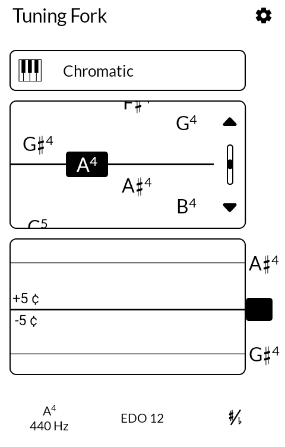
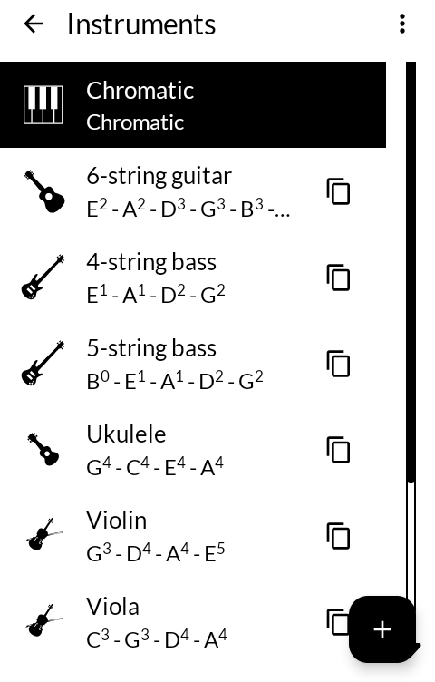
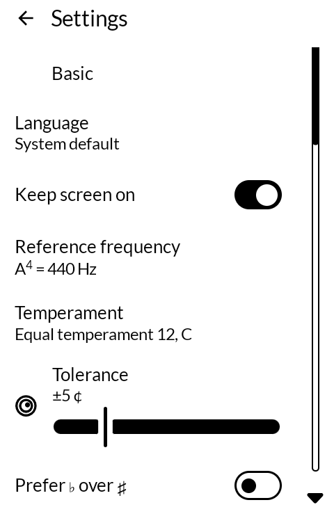
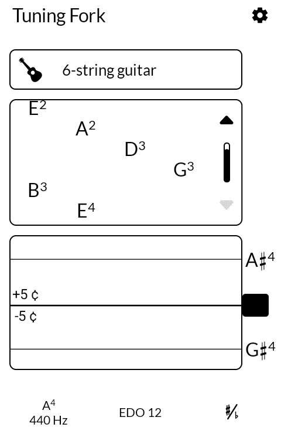

# Tuning Fork

音叉 *onsa*

A chromatic and instrument tuner for an E Ink phone. Black on white, no colour anywhere,
and the screen stays awake while you play.

Built for the [Mudita Kompakt](https://mudita.com/products/kompakt/), whose 4.3" panel has
sixteen greys, a slow redraw, and is read at arm's length on a music stand.

## Screenshots

| | | | |
|---|---|---|---|
|  |  |  |  |

## What it is

Michael Moessner's [Tuner](https://codeberg.org/thetwom/Tuner), re-clothed for E Ink. It is
a serious instrument: chromatic and per-instrument tuning, a pitch history plot, a cents
readout, stretch tuning, and a temperament editor that goes well past equal temperament —
just intonation, meantone, Werckmeister, Kirnberger, and any custom scale you care to
enter.

None of that is mine. What is mine is what it looks like and how it behaves on this screen.

## What changed for E Ink

**One appearance.** Light, dark, black-night and dynamic colour are gone. The panel has one
appearance — dark marks on a light ground, in daylight — and a theme setting the hardware
cannot honour is a setting that lies. The Appearance row is gone from settings with it.

**In tune is not green.** Upstream says in-tune and out-of-tune in green and red. On sixteen
greys those arrive as two near-identical mid-tones, so an app leaning on them says nothing
and says it confidently. Both are black here, and the reading is carried by where the
needle sits against the centre line — which is how a mechanical tuner did it before anyone
had a colour display.

**The screen stays on by default.** Upstream makes this a setting and defaults it off; it is
still a setting, and it now starts on. A tuner sits on a music stand and is glanced at
between phrases, and you cannot put down a bow to wake a phone.

**No icons on settings rows.** On this panel a small glyph beside every row costs a column
of width and renders as a smudge. The label is the thing.

**MMD lists.** The scrolling lists use MMD's, which step rather than glide — a fling on
E Ink is a smear.

**Larger plot type.** Upstream's 14sp is sized for a phone in the hand. This is read from a
music stand.

## Known rough edge

The temperament list truncates its titles at this width — six rows all reading "Equal
temperame…", told apart only by the line beneath. It works, but it is not good, and it is
the next thing to fix.

## Building

```
./gradlew assembleRelease
```

A release is signed by a keystore in `signing/`, which is not in this repository. Without
it the release APK builds **unsigned** and will not install anywhere — there is no fallback
key by design.

## Credit

After [Tuner](https://codeberg.org/thetwom/Tuner) by Michael Moessner. The pitch detection,
the temperaments, the note naming and the instrument definitions are all his, unchanged —
that is the substance of the app, and roughly ten thousand lines of it.

The interface was already Jetpack Compose, so this is a re-clothing rather than a rebuild:
the theme is [MMD](https://github.com/mudita/MMD), Mudita's E Ink component library.

## Licence

**GNU General Public License v3.0 or later.** See [LICENSE](LICENSE).

Note that this is *or later*, not the GPL-3.0-only these apps otherwise use. The work it
derives from was published under "version 3 of the License, or (at your option) any later
version", and that option was granted to everyone downstream. It is not mine to take away.

Copyright © wander wildwood, and © 2024 Michael Moessner for the parts that are his.
